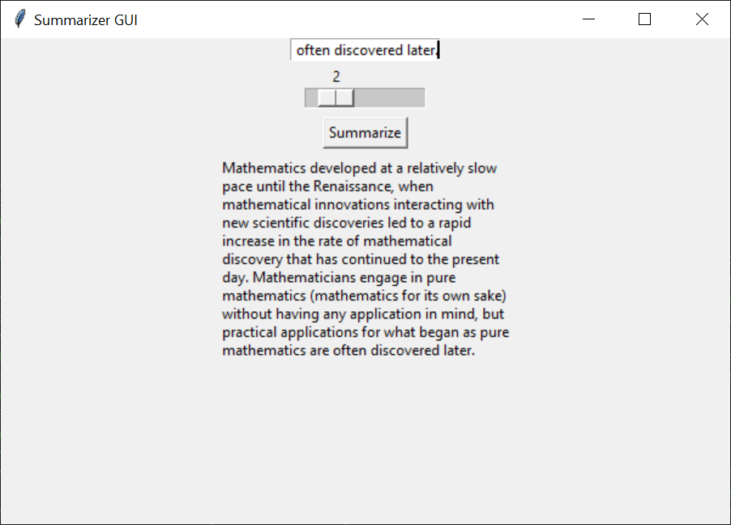

# SummarizerGUI

A GUI made in Python's Tkinter that summarizes a body of text using the method below:

- method: https://stackabuse.com/text-summarization-with-nltk-in-python/

### Requirements
- Python 3 (I used Python 3.8)
- If you don't already have these Python modules, install the following `NLTK` and `Pandas`

### How to use
- Download the `bin` directory and run `main.py`
- Copy some text and paste into the input field
- Use the scroll bar to summarize to some number of sentences
- Hit the "Summarize" button to get a summary!

### Example

- Summary (to two sentences) of the first section of this page: https://en.wikipedia.org/wiki/Mathematics

